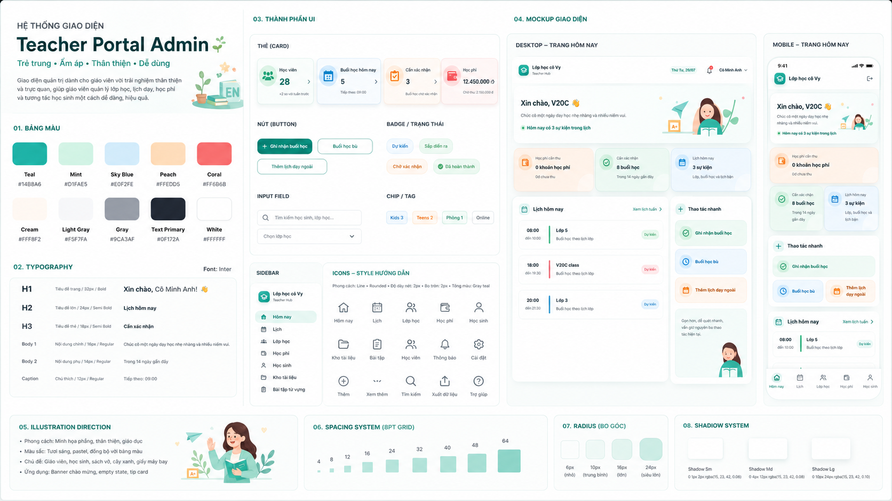
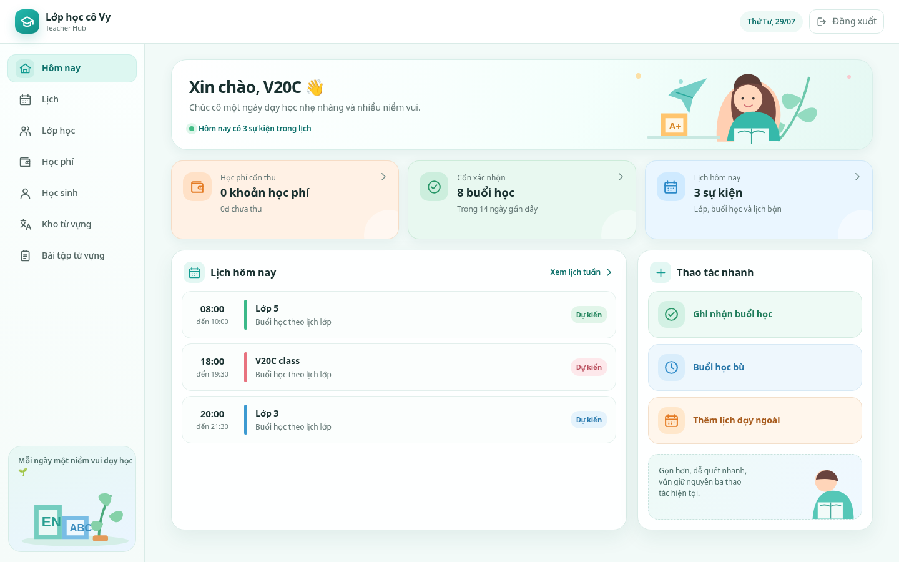
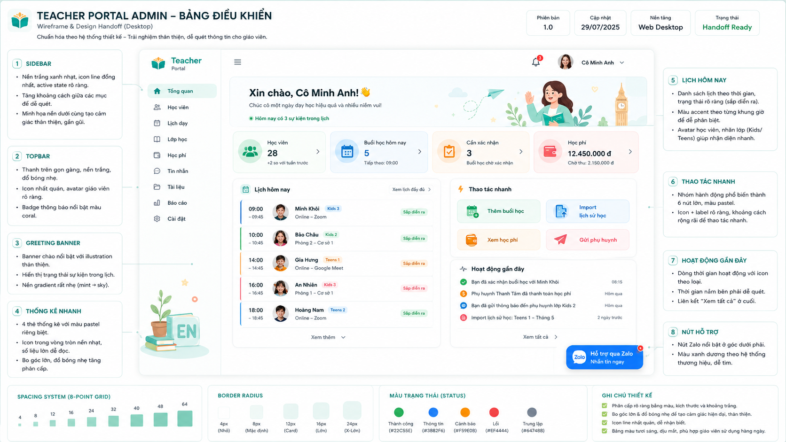
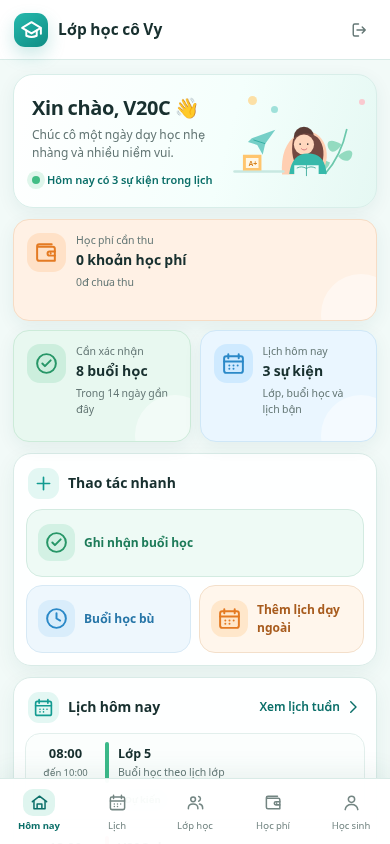
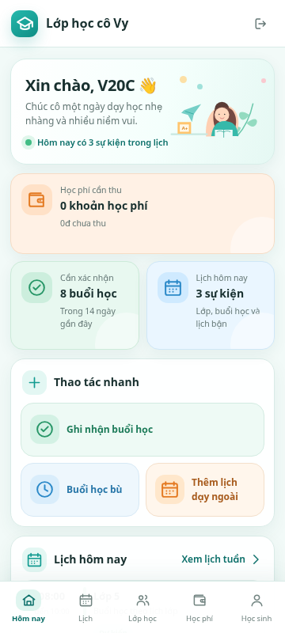
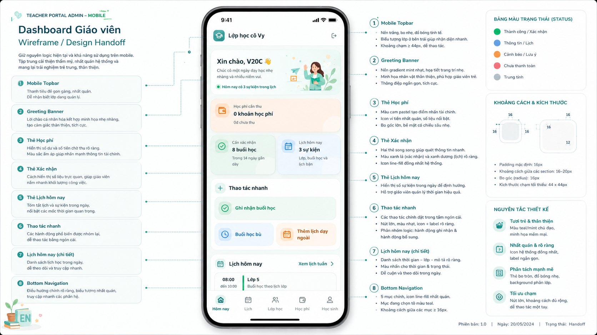

# Admin UI visual refresh — design handoff

> Trạng thái: **IMPLEMENTED – PENDING FINAL VISUAL REVIEW**
> Phạm vi: khu vực quản lý giáo viên `/admin/*`
> Mục tiêu: đổi diện mạo, không đổi nghiệp vụ, API, route hoặc luồng thao tác.

## 1. Mục tiêu

Giao diện quản lý hiện tại đúng chức năng nhưng còn phẳng, nhiều khoảng trống và thiếu
nhận diện riêng cho một lớp tiếng Anh. Đợt refresh này làm hệ thống tươi trẻ, ấm áp,
thân thiện với giáo viên và phù hợp bối cảnh dạy học sinh lớp 1–9, nhưng không biến
Admin thành giao diện trẻ em hoặc Homepage marketing.

Các thay đổi chỉ thuộc lớp trình bày:

- bỏ tím khỏi vai trò primary/active của Admin;
- dùng teal, mint, sky blue, peach và coral có tiết chế;
- tăng phân cấp card, section, sidebar và topbar;
- bổ sung minh họa giáo dục cục bộ;
- chuẩn hóa spacing, radius, shadow, icon và trạng thái;
- giữ nguyên dữ liệu thật và hành vi responsive hiện có.

## 2. Ranh giới bắt buộc

Không được thay đổi:

- route, navigation item, thứ tự điều hướng và quyền truy cập;
- API, request/response contract, query key, cache hoặc server state;
- business rule, state machine, validation, cách tính học phí;
- nội dung metric hoặc danh sách hiện có chỉ để làm giống ảnh minh họa;
- hành vi form, dialog, bottom sheet, lịch, lesson wizard và import;
- mobile flow đang hoạt động tốt;
- loading, empty, error, disabled, focus và accessibility semantics.

Không thêm các khối như **Học viên**, **Hoạt động gần đây**, **Tin nhắn**, avatar học
sinh hoặc dữ liệu demo nếu source hiện tại không có. Một số bảng handoff có những chi
tiết này để diễn tả phong cách; chúng không phải yêu cầu nghiệp vụ.

## 3. Thứ tự nguồn tham chiếu

Khi có khác biệt, dùng thứ tự sau:

1. Business rule, contract, feature document và source hiện tại.
2. Hai ảnh Playwright đã duyệt:
   - [`01-dashboard-desktop-approved.png`](../wireframes/admin-ui-refresh/01-dashboard-desktop-approved.png)
   - [`02-dashboard-mobile-390-approved.png`](../wireframes/admin-ui-refresh/02-dashboard-mobile-390-approved.png)
3. Ảnh kiểm tra mobile 360 px:
   - [`03-dashboard-mobile-360-approved.png`](../wireframes/admin-ui-refresh/03-dashboard-mobile-360-approved.png)
4. Design-system board và handoff board chỉ dùng để hiểu palette, spacing, icon,
   illustration và visual hierarchy.
5. Ảnh inspiration chỉ dùng để lấy tinh thần; không sao chép bố cục hoặc nội dung.

## 4. Visual target đã duyệt

### 4.1 Design system



Lưu ý: font ghi trong ảnh board chỉ mang tính minh họa. Production tiếp tục dùng
**Be Vietnam Pro** như hệ thống hiện tại.

### 4.2 Desktop



Desktop tổ chức theo thứ tự:

1. Admin shell hiện tại: sidebar + topbar.
2. Greeting banner ngắn, có minh họa đặt bên phải.
3. Các metric hiện có, giữ đúng dữ liệu và số lượng trong source.
4. Nội dung chính hai cột khi đủ rộng:
   - lịch hôm nay là khu vực chính;
   - thao tác nhanh là khu vực phụ.
5. Không ép thêm section mới chỉ để lấp khoảng trắng.

Handoff có chú thích:



Ảnh handoff trên có thể chứa dữ liệu minh họa không tồn tại trong source. Chỉ lấy
phong cách card, sidebar, banner, icon, khoảng cách và màu sắc.

### 4.3 Mobile





Mobile tiếp tục giữ topbar và bottom navigation hiện tại. Bố cục mục tiêu:

1. Greeting banner compact.
2. Metric tài chính toàn chiều ngang nếu cần ưu tiên đọc.
3. Hai metric còn lại có thể chia hai cột khi đủ chỗ.
4. Thao tác chính nổi bật; thao tác phụ cân bằng và chạm dễ.
5. Lịch hôm nay nằm sau quick actions.
6. Không có horizontal scroll ở 360 px.
7. Nội dung cuối trang không bị bottom navigation hoặc safe-area che.

Handoff có chú thích:



## 5. Bảng màu Admin

| Vai trò | Token đề xuất | Giá trị | Cách dùng |
|---|---|---:|---|
| Primary | Teal 500 | `#14B8A6` | CTA chính, active navigation, focus accent |
| Primary strong | Teal 700 | `#0F766E` | chữ/hover cần tương phản cao |
| Mint surface | Mint 100 | `#D1FAE5` | xác nhận, success grouping, card nền nhẹ |
| Sky surface | Sky 100 | `#E0F2FE` | lịch, thông tin, secondary action |
| Peach surface | Peach 100 | `#FFEDD5` | học phí, lưu ý, action bổ sung |
| Coral accent | Coral 500 | `#FF6B6B` | cảnh báo nhỏ, badge cần chú ý; không làm primary |
| Canvas | Light neutral | `#F5F7FA` | nền nội dung Admin |
| Text primary | Slate 900 | `#0F172A` | heading và body quan trọng |
| Text secondary | Slate 500 | `#64748B` | mô tả, metadata |
| Surface | White | `#FFFFFF` | card, sidebar, topbar |

Quy tắc:

- Không dùng tím/violet làm primary, active navigation, progress hoặc focus trong Admin.
- Màu không là tín hiệu duy nhất; luôn có icon, nhãn hoặc cấu trúc.
- Coral chỉ là accent nhỏ, tránh biến giao diện thành quá nhiều màu.
- Không thay màu semantic server status tùy ý nếu làm sai ý nghĩa hiện tại.

## 6. Typography, spacing và elevation

- Font production: **Be Vietnam Pro**.
- Body chính: 14–15 px.
- Section title: 17–18 px.
- Page/greeting title: 20–24 px mobile, 26–32 px desktop tùy không gian.
- Tránh weight 900; ưu tiên 400, 500, 600, 700 và 800.
- Grid cơ sở: 8 px; cho phép 4 px cho tinh chỉnh icon/badge.
- Card padding: 16 px mobile, 18–24 px desktop.
- Khoảng cách section: 16–20 px mobile, 20–24 px desktop.
- Radius mặc định: 12 px; card chính 16 px; banner lớn tối đa 20–24 px.
- Shadow dùng nhẹ và nhất quán, không tạo glow màu.
- Touch target tối thiểu 44 × 44 px.

## 7. Icon và component

- Tiếp tục dùng `@mui/icons-material`; không cắt icon từ ảnh handoff.
- Chọn icon rounded/outlined nhất quán theo vai trò.
- Icon metric đặt trong nền tròn/pill pastel, nhưng nhãn và số liệu vẫn là trọng tâm.
- Button chính teal solid hoặc tint rõ; button phụ dùng surface màu nhạt, không dùng
  outline tím.
- Badge/status có nền pastel, text tương phản và label tiếng Việt.
- Card có border rất nhẹ + shadow; tránh chỉ dựa vào border xám mỏng như hiện tại.

## 8. Illustration assets

Hai asset đã chuẩn bị sẵn trong thư mục wireframe:

| Asset | Mục đích | Quy tắc |
|---|---|---|
| [`assets/teacher-dashboard-hero.png`](../wireframes/admin-ui-refresh/assets/teacher-dashboard-hero.png) | Greeting banner | Decorative, đặt bên phải, crop bằng `object-fit: contain`, ẩn bớt trên màn rất hẹp nếu chèn ép nội dung |
| [`assets/sidebar-english-learning.png`](../wireframes/admin-ui-refresh/assets/sidebar-english-learning.png) | Cuối sidebar desktop | Chỉ trang trí; ẩn ở mobile và khi chiều cao viewport không đủ |

Có thêm bản WebP để cân nhắc khi triển khai. PNG giữ alpha và phù hợp làm source.

Quy tắc sử dụng:

- asset được bundle/local; không gọi Pixabay, Unsplash hoặc API ảnh ở runtime;
- decorative image dùng `alt=""` và `aria-hidden="true"`;
- không dùng hình minh họa trong mọi card;
- ưu tiên greeting banner, sidebar desktop và empty state có chọn lọc;
- không dùng text quan trọng nằm bên trong ảnh;
- tối ưu kích thước trước khi đưa vào production bundle.

Path production đề xuất cho giai đoạn code sau:

```text
client/public/assets/admin-ui/teacher-dashboard-hero.webp
client/public/assets/admin-ui/sidebar-english-learning.webp
```

Đây chỉ là đề xuất tổ chức asset, chưa phải yêu cầu sửa code trong bước tài liệu.

## 9. Responsive acceptance cho đợt triển khai sau

Bắt buộc review tại:

- mobile: 360, 375, 390, 393, 400, 412, 430 px;
- tablet: 768 px;
- desktop: 1280 và 1440 px.

Kỳ vọng:

- không horizontal scroll;
- text không bị cắt sai;
- sticky/bottom navigation không che action hoặc cuối danh sách;
- sidebar illustration không đẩy menu hoặc gây overflow chiều cao;
- metric và quick action không đổi ý nghĩa hoặc thứ tự logic;
- keyboard focus rõ;
- `prefers-reduced-motion` vẫn được tôn trọng.

## 10. Phạm vi cập nhật tài liệu trong cùng thay đổi

Khi nhập bộ handoff này vào repository, cần cập nhật đồng bộ:

1. `docs/README.md`
   - thêm link tới tài liệu này;
   - nói rõ Playwright approved screenshots là visual target mới cho Admin dashboard.
2. `docs/features/admin-ui.md`
   - thay mô tả lavender/purple bằng palette teal/mint/sky/peach/coral;
   - thêm ranh giới không đổi logic/API/route;
   - thêm quy tắc illustration local và không tạo dữ liệu giả.
3. `docs/design/ui-guidelines.md`
   - đổi primary Admin từ purple/violet sang teal;
   - giữ Homepage độc lập, không ép Homepage theo Admin;
   - bổ sung illustration, card elevation, local asset và decorative accessibility.
4. `docs/wireframes/README.md`
   - đăng ký thư mục `admin-ui-refresh/`;
   - ghi thứ tự ưu tiên giữa ảnh Playwright approved và annotated handoff board;
   - nhắc lại ảnh không được ghi đè business rule.
5. `docs/implementation/status.md`
   - chỉ thêm một dòng **DESIGN APPROVED / NOT IMPLEMENTED** nếu file này có khu vực
     phù hợp cho backlog/next work;
   - không đánh dấu implemented.

Danh sách trên ghi lại phạm vi đồng bộ tài liệu ở thời điểm handoff được duyệt. Đợt
implementation vẫn không sửa acceptance, API, ADR hoặc product business rule.

## 11. Trạng thái triển khai 29/07/2026

Visual refresh đã được triển khai cho theme Admin, login, `AdminLayout`, Dashboard và
các component dùng chung trong `UiKit`. Theme teal được lồng riêng cho `/admin/*` để
không đổi palette Homepage. Hai illustration WebP local được bundle tại
`client/public/assets/admin-ui/`; không có ảnh remote hoặc dependency runtime mới.

Đã kiểm tra Dashboard bằng screenshot runtime tại 1440×900, 1366×768, 390×844 và
360×800; các ảnh được giữ trong test artifact tạm, không commit vào wireframe. Audit
responsive xác nhận không tràn ngang, sidebar/bottom navigation đổi đúng breakpoint,
bottom navigation không che item cuối và sidebar illustration không che menu.

Các khác biệt có chủ đích so với board: giữ đúng ba metric, ba quick action, menu,
event và dữ liệu thật của source; không thêm hoạt động gần đây, avatar, thông báo,
import hoặc các action demo. Các trang quản lý còn lại chỉ nhận token/card/form/table/
dialog/badge mới, không được thiết kế lại luồng nghiệp vụ.

Kiểm tra targeted đã chạy: client typecheck, lint, unit test, production build,
Playwright responsive/navigation smoke và schedule operations đều PASS. Gate cuối
`npm run check:full` cũng PASS toàn bộ typecheck, lint, build, unit, integration, E2E
và repository consistency.
